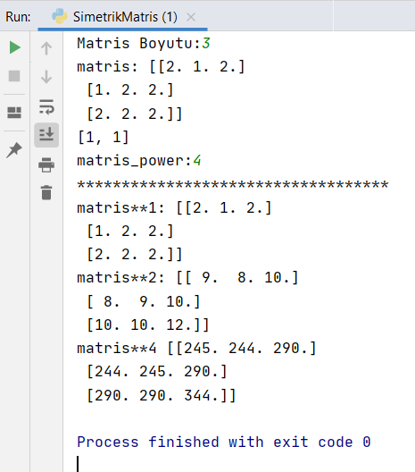
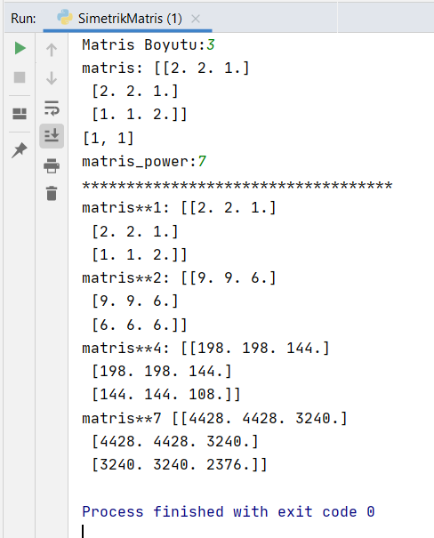
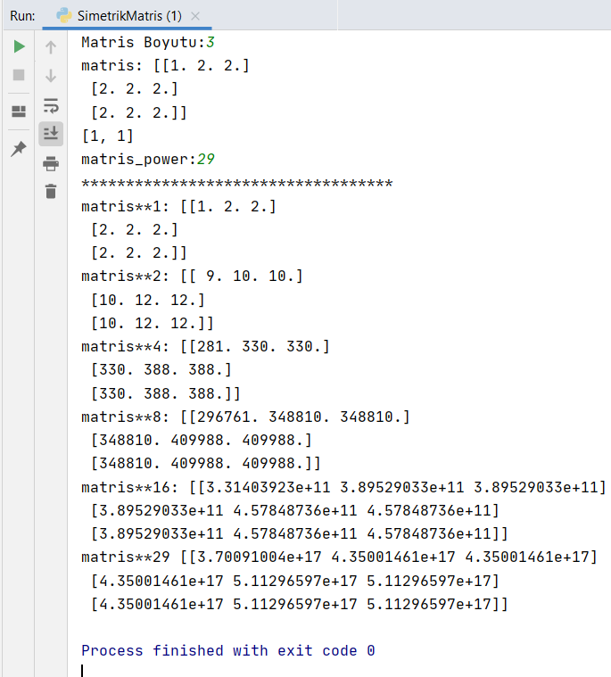
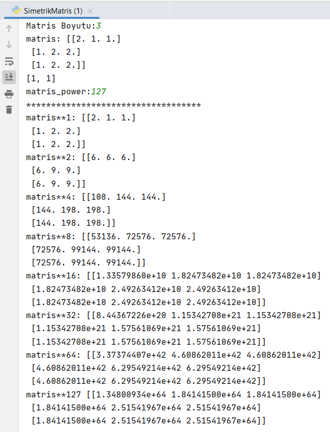
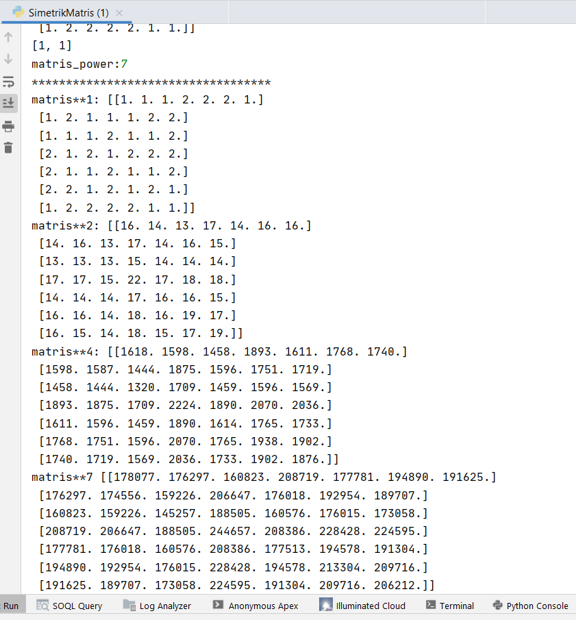
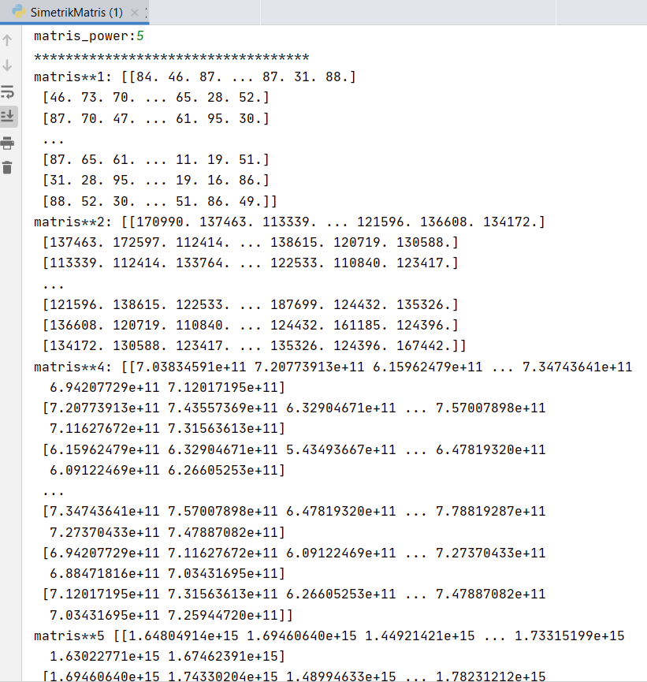
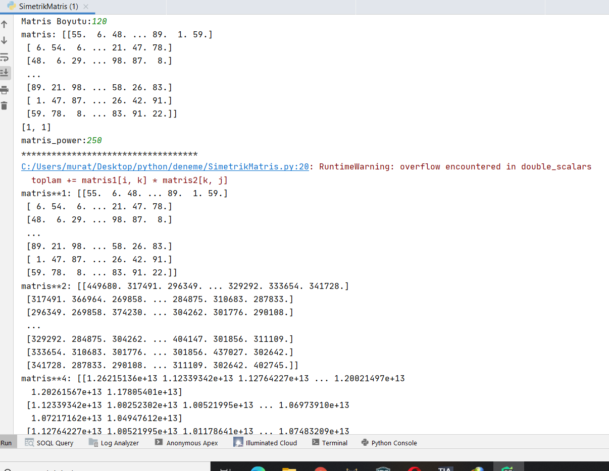
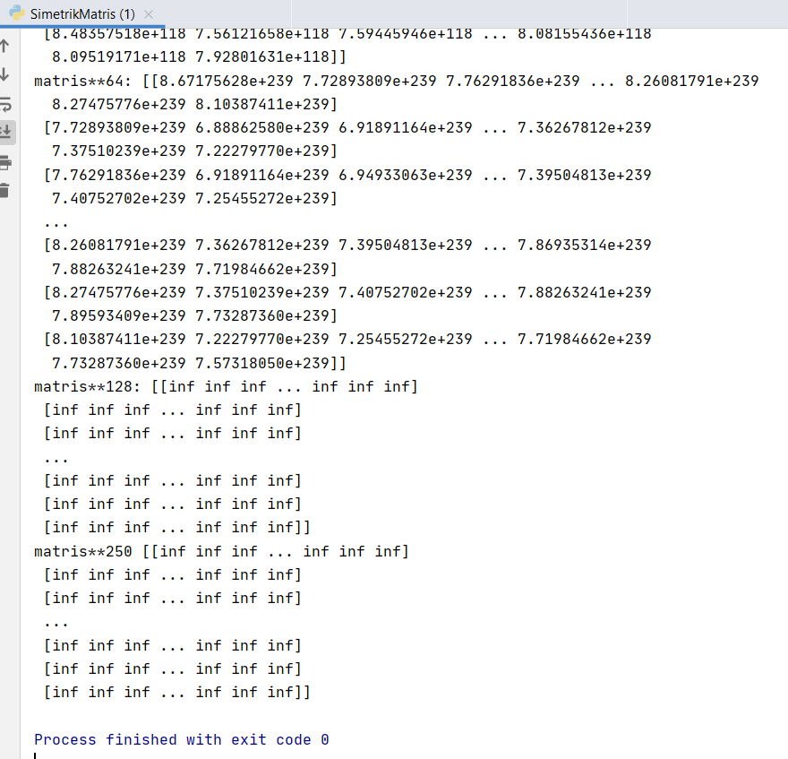

## 1) Random olarak simetrik matris oluşumu:

- **Numpy kütüphanesi** sayesinde listelerden çok daha yüksek performansa sahip matris oluşturuldu.

- İstenilen herhangi bir boyutta **random** olarak simetrik matris oluşturulabilir.

- Simetrik matris olduğu için ` for j in range(i, n):`ile sadece `j>=i`  ye bakmak yeterlidir böylece iterasyon sayısı azalacaktır ve performans yaklaşık 2 kat artacaktır.

```Python
import numpy as np
n=int(input("Matris Boyutu:"))
random_matris=np.zeros(n**2).reshape(n,n)
np_matris=random_matris
for i in range(n):
    for j in range(i, n): # Oluşan matris simetrik olduğu için köşegen ve üstüne bakmak yeterli olacaktır.
        random_matris[i][j] = np.random.randint(1,100)
        random_matris[j][i] =  random_matris[i][j]
print(np_matris)
```

## 2) Matris çarpımları

- Yeni oluşan matriste simetrik matris olduğu için  ` for j in range(i, n):` ile sadece `j>=i`  ye bakmak yeterlidir böylece iterasyon sayısı azalacaktır ve performans yaklaşık 2 kat artacaktır.

```Python
import numpy as np
def matris_mulp(matris1, matris2):
    result_matris = np.zeros(len(matris1) ** 2).reshape((len(matris1), len(matris1)))
    for i in range(len(matris1)):
        for j in range(i, len(matris1)):# Oluşan matris simetrik olduğu için köşegen ve üstüne bakmak yeterli olacaktır.
            toplam = 0
            for k in range(len(matris1)):
                toplam += matris1[i, k] * matris2[k, j]
            result_matris[i,j] = toplam
            result_matris[j,i] = toplam
    return result_matris
```

## 3)Pow değerinin binary'e çevrilmesi

- Örneğin: **n** sayısı **18** ise **[0, 1, 0, 0, 1]** şeklinde sonuç döndürür.
- Pow değerini binary'e çeviririz. Böylece stackteki istenilen matrislere rahatlıkla ulaşabiliriz.

- Burda **1** sonucu olanları matris_pow fonksiyonunda kullanıldı.

```Python
def binarydecoder(n):
    z= n
    l = []
    if z < 1:
        return l
    while z >= 1:
        l.append(z % 2)
        z //= 2
    return l
```

## 4)Stack üzerinde hesaplanmış matrislerin tutulması

- Performas açısından maximum verim ile çalışması için dinamik bellek yöntemi kullanılmıştır.

### 1.Adım

- `stack = [matris]` matrisin birinci kuvveti ilk başta yerleştirildi.
- Matrisin **1, 2, 4 ,8 ,16,32,64,128 ...** şeklindeki tüm ihtiyaç olan çarpımları oluşturuldu.
- `stack[0]`=matrisin kendisi, `*stack[1]`=matrisin ** 2 (karesi), `stack[2]`=matrisin ** 3, `stack[3]`=matrisin ** 4 **...** şeklinde tutulur.

### 2.Adım

- Şimdi ise 2 nin tam kuvveti olmama durumu için gerekli çarpmaları yapıyoruz. Mesela **3, 7,10,19, 49, 122, 142** vb

- Örneğin:**19** için `stack[-1]` * `stack[1]` * `stack[0]` yani  **`matris**16`** * **`matris**2`** * **`matris`** işlemi gerçekleşir.
### 3.Adım
- Bu adımda ise stack'teki kaydedilmiş sonuçlara ulaşıldı.
```Python
def matris_pow(matris, pow):
    #1.Adım
    stack = [matris]
    bin = binarydecoder(pow)
    # print(f"bin: {bin}")
    for i in range(len(bin)-1):
        stack.append(matris_mulp(stack[-1], stack[-1]))
    #2.Adım
    maxpow2_matris = np.copy(stack[-1])
    result=maxpow2_matris
    for i in range(len(bin) - 1):
        if bin[i] == 1:
            # print(f"i: {i}")
            result = matris_mulp(maxpow2_matris, stack[i])
            stack.append(result)
    #3.Adım
    for k in range(100):
        if pow<=(2**k):
            matris_sayisi=k+1
            break
    for i in range(matris_sayisi-1):
            if i!=matris_sayisi-1:
                n_matris=2**i
            print(f"matris**{n_matris}:",stack[i])
    return result
```

## 5)Matris Power Seçimi

- Matris Power seçerken, matrisin boyutu ve random matrisinin içindeki elemanların büyüklüğüne göre seçim yapılmalıdır. Bu üç değer çok büyük seçilirse:
    * **RuntimeWarning: overflow encountered in double_scalars\
  toplam += matris1[i, k] * matris2[k, j]**

   * **[[inf inf inf ... inf inf inf]
  [inf inf inf ... inf inf inf] \
  [inf inf inf ... inf inf inf] \
 ...\
  [inf inf inf ... inf inf inf] \
  [inf inf inf ... inf inf inf] \
  [inf inf inf ... inf inf inf]]**
  
   - Şeklinde hatalar alınabilir. Çünkü matris çarpmımlarında numpy dizisinin oluşturulma sınır sorunu oluşur. Örneğin 100x100 boyutlu matrisin 250. kuvetini hesaplayamıyoruz.

```Python
matris_power=int(input("matris_power:"))
print(matris_pow(np_matris, matris_power))
```

## 6)Sonuçlar

**1)**



**2)**



**3)**



**4)**



**5)**



**6)**



**7)**




